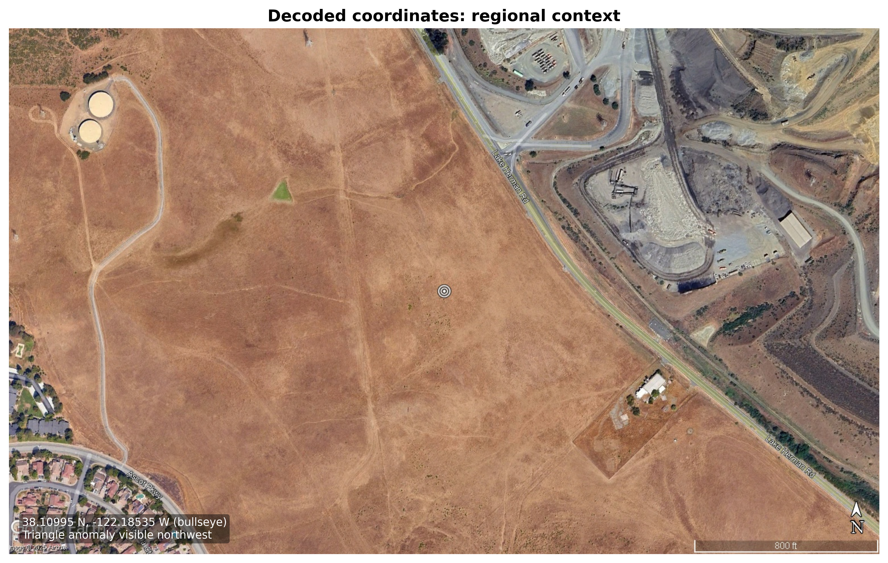
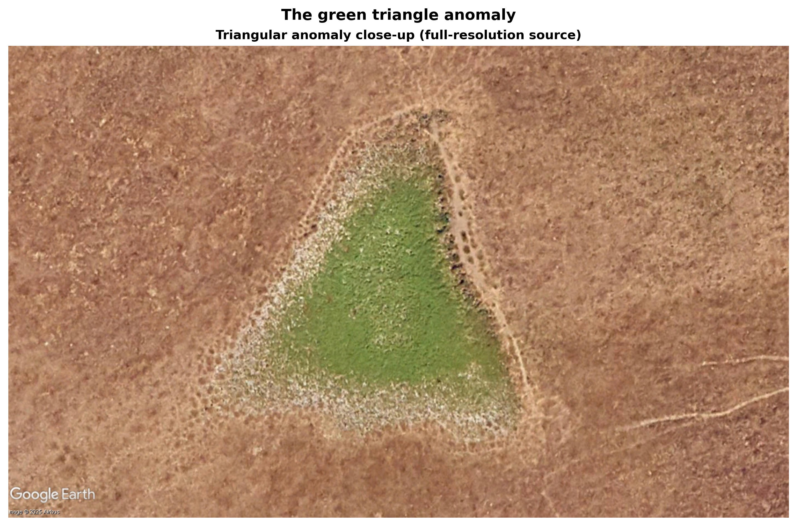
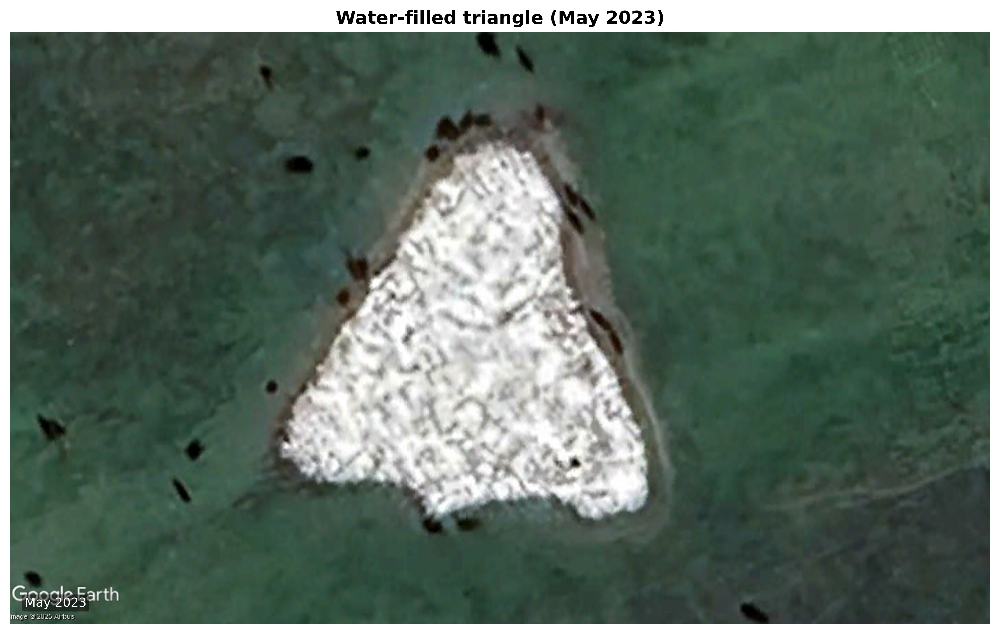
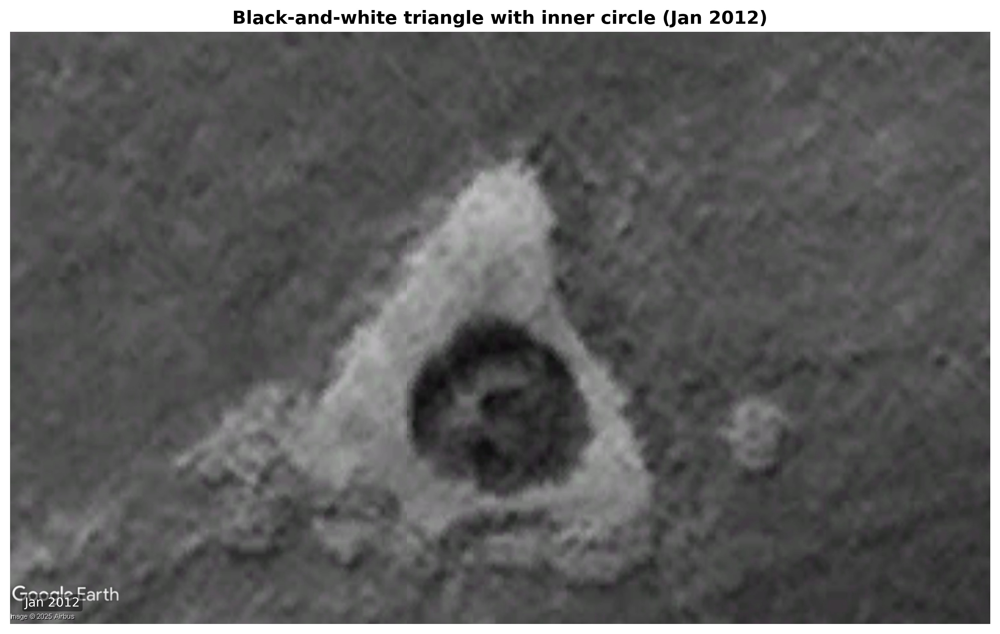
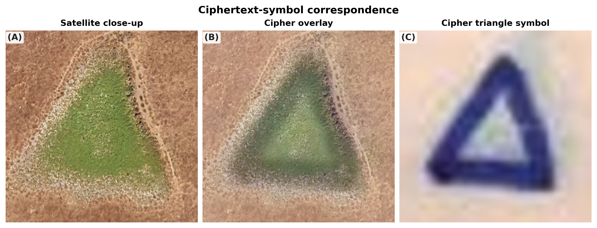
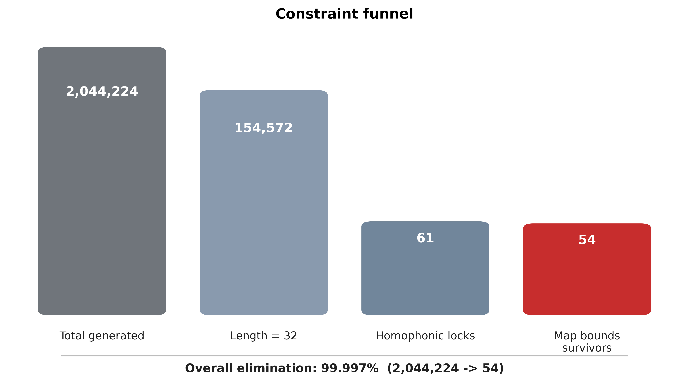
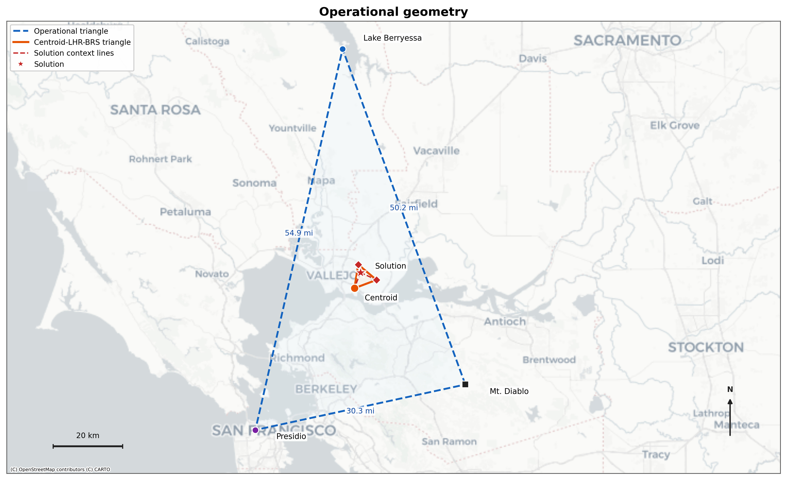
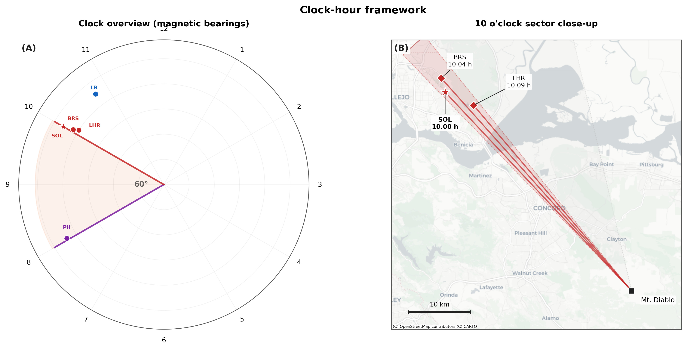
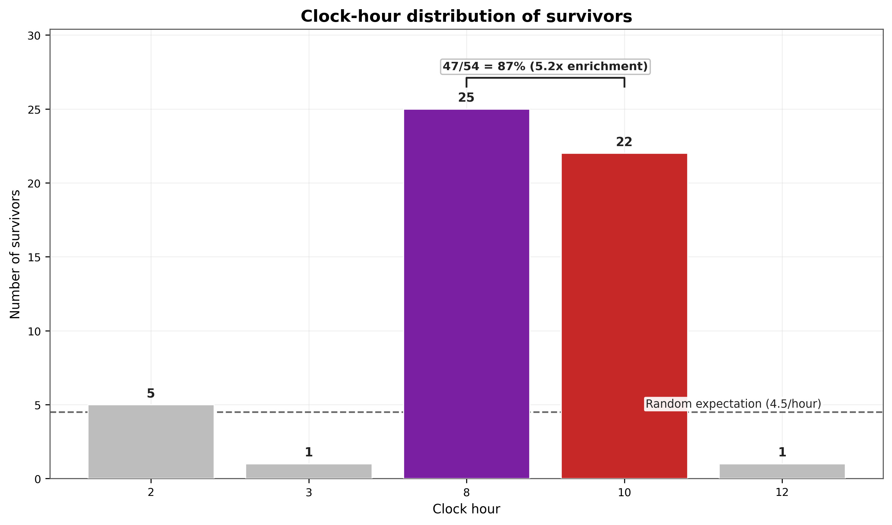
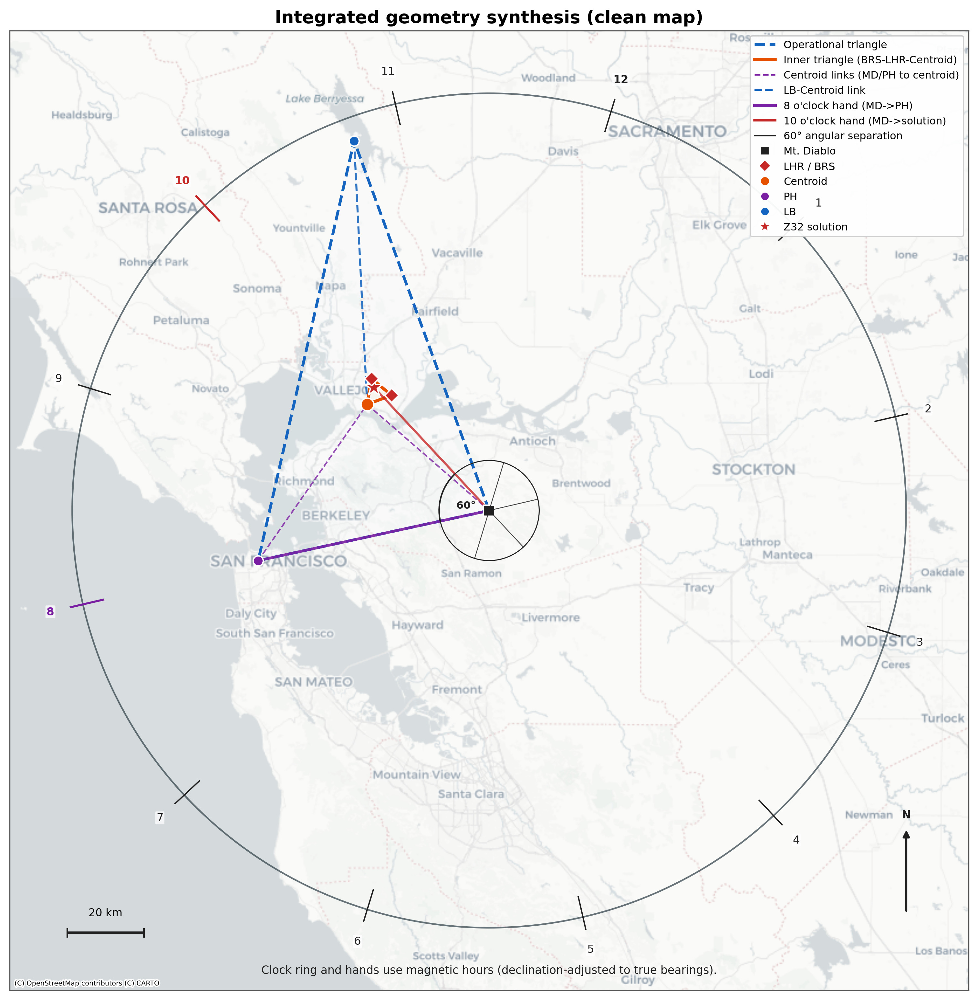

# Geospatial Constraint Satisfaction in the Zodiac Z32 Cipher

> *"The Map coupled with this code will tell you where the bomb is set. You have until next Fall to dig it up... radians & # inches along the radians."*
> — The Zodiac Killer, June 26, 1970

## Introduction

The Z32 cipher — 32 characters, 29 unique symbols — has resisted every decryption attempt for over 55 years. Every prior effort treated it as a linguistic puzzle. But the Zodiac didn't send Z32 alone. He sent it with a road map, a crosshair on a mountain, and explicit instructions to measure inches along radial lines.

This project treats Z32 as what the Zodiac told us it was: **a set of geographic coordinates.**

The code exhaustively generates **2,044,224** candidate navigational phrases and filters them through three independent constraints. Only **54 survive** — a 99.9974% rejection rate. The top-ranked survivor:

```
IN THREE AND THREE EIGHTHS RADIANS TEN
```

Measure 3⅜ inches along the 10 o'clock radial from Mount Diablo on the Phillips 66 map. The result points to a hillside in Solano County — 1.15 miles from the Blue Rock Springs attack and 2.47 miles from Lake Herman Road.

What's at the decoded coordinates is what makes this solution different from every other attempt.

---

## The Decoded Coordinates (Satellite Image)


*The bullseye marks the decoded coordinates (38.10995°N, 122.18535°W). The green triangle is visible to the upper left — 254 meters from the projected point, or 0.025 inches on the map. That's the width of a pencil line drawn on a 1970 road map. (Imagery © Google Earth, Airbus)*

---

## The Green Triangle


*A 100-foot equilateral triangular depression with a pronounced positive crop mark: the interior grows green while everything around it is brown and dormant. In archaeological remote sensing, this signature indicates subsurface soil disturbance — excavated and backfilled earth that retains moisture. Consistent with: "You have until next Fall to dig it up." (Imagery © Google Earth, Airbus)*

---

## Additional Imagery Analysis

| | |
|:---:|:---:|
|  |  |
| *May 2023: the triangle collects standing water after rain, confirming a physical depression — not a surface marking. (Imagery © Google Earth, Airbus)* | *January 2012 (B&W enhanced): sharp triangular edges and a concentric inner circle. This morphology — an outer triangle enclosing an inner circle — is consistent with deliberate construction. (Imagery © Google Earth, Airbus)* |

The feature was **not present in 1964 aerial imagery** but is clearly visible by **1982**, bracketing its creation to an 18-year window that includes the Zodiac's active period (1968–1970). It persists across every available imagery date from 1982 to 2025. Readers can independently verify this at the cited coordinates using [HistoricAerials.com](https://www.historicaerials.com).

---

## The Cipher's Triangle Symbol


*The Z32 ciphertext contains triangle symbols (△) at positions 1, 11, and 31. Positions 1 and 31 form one of the three homophonic lock pairs — the triangle literally bookends the cipher. Left: satellite close-up. Center: cipher overlay. Right: the triangle symbol from the Z32 ciphertext. (Satellite imagery © Google Earth, Airbus)*

---

## The Constraint Funnel

How does a 32-character cipher with no frequency-analysis foothold produce a unique answer? By exploiting the boundary conditions the Zodiac himself provided.

The cipher reuses three symbols at positions (0,25), (1,31), and (5,13), meaning those character pairs in any valid plaintext *must match*. Combined with the 32-character length requirement and the geographic bounds of the Phillips 66 map, these constraints eliminate 99.9974% of all possible navigational phrases.


*Of 2,044,224 candidates, only 54 survive all three filters. The homophonic lock filter alone eliminates 99.96% of length-32 candidates.*

The solution satisfies all three locks:

- Position 0 (**I**) = Position 25 (**I**) ✓
- Position 1 (**N**) = Position 31 (**N**) ✓
- Position 5 (**E**) = Position 13 (**E**) ✓

Only two other candidates land within 2.5 miles of a crime scene — and neither converges with the triangle. The next-nearest candidate is **3,620 meters** from the feature — 14.3× farther.

---

## Crime Scene Geometry

The Zodiac drew clock-hour numbers (0, 3, 6, 9) on his crosshair centered on Mt. Diablo, with the instruction "0 is to be set to Mag. N." When you compute the magnetic bearing from Mt. Diablo to each confirmed crime scene, they snap to whole clock-hour positions:

| Location | Mag. Bearing | Clock Hour |
|----------|-------------|------------|
| Presidio Heights (10/11/1969) | 240.93° | **8.03** |
| Lake Herman Road (12/20/1968) | 302.74° | **10.09** |
| Blue Rock Springs (07/04/1969) | 301.34° | **10.04** |
| **Z32 Solution** | **300.00°** | **10.00** |

Every Vallejo-area attack falls in the 10 o'clock sector. The Presidio Heights attack falls at 8.03. The decoded solution falls at *exactly* 10.00 — the cipher's plaintext literally ends with the word **TEN**.

This was not derived from the cipher. The crosshair with clock numbers was drawn by the Zodiac himself. The alignment of crime scenes to whole clock hours is an independent geographic fact, discovered after decryption.

---

## The Operational Triangle


*The three cardinal points of the Zodiac's geography — Mt. Diablo, Lake Berryessa, and Presidio Heights — form the operational triangle (50.2 mi, 30.3 mi, 54.9 mi). The decoded solution falls just 2.37 miles from its geometric centroid — an offset of 4.3% relative to the triangle's 54.9-mile span. The cipher points to the geographic center of the Zodiac's known operational region. (Map base © OpenStreetMap contributors, © CARTO)*

The two nearest crime scenes (Lake Herman Road, Blue Rock Springs) and the centroid form a **near-equilateral triangle**: sides of 3.34, 3.31, and 3.36 miles; interior angles of 59.2°, 60.7°, and 60.0°. Maximum deviation from perfect equilateral: **0.8°**. Monte Carlo probability of this occurring by chance: approximately **1 in 37,000**.

---

## The Clock-Hour Framework


*Left: clock-hour positions of crime scenes and the decoded solution, with the 60° sector between 8 and 10 o'clock highlighted. Right: the 10 o'clock sector projected onto the map — all Vallejo scenes and the decoded solution fall within it. (Map base © OpenStreetMap contributors, © CARTO)*

Before the cipher is even decoded, the Presidio Heights and Blue Rock Springs crime scenes are separated by **60.41°** as viewed from Mt. Diablo — within 0.41° of a perfect 60° sector. This is a verifiable geographic fact that exists independent of the cipher solution.

The decoded solution tightens this to **59.07°** — closer still to the 60° ideal.

---

## The Cipher's Structural Bias

Of the 54 surviving candidates, **47 (87%)** decode to clock hours 8 or 10 — the two directions corresponding to the Zodiac's known crime zones. With 12 possible clock hours, the expected random rate for any two hours is 16.7%. The observed rate is **5.2× enriched**.



This is not a post-hoc filter. It is a property of the cipher's internal lock structure: the character constraints at positions (0,25), (1,31), and (5,13) mechanically favor the terminal words EIGHT and TEN. The cipher, by its own construction, preferentially generates solutions pointing toward the Zodiac's crime zones.

---

## All Lines Converge


*All geometric relationships on a single map: the operational triangle, inner equilateral, clock-hour framework, and decoded coordinates converge at one location. (Map base © OpenStreetMap contributors, © CARTO)*

No single line of evidence constitutes proof. Together, they form an interlocking web of cryptographic, geographic, archaeological, and structural constraints that all point to the same location:

1. **The cipher constrains the answer.** 54 of 2,044,224 candidates survive — a 99.9974% rejection rate.
2. **The geography confirms the cipher.** The decoded point falls in the heart of the Zodiac's Vallejo crime zone, 2.37 miles from the operational centroid.
3. **The ground evidence corroborates both.** A persistent 100-foot triangular crop mark sits 254 meters from the projected coordinates — the width of a pencil line on the map.
4. **The cipher's own structure encodes the crime geography.** 87% of survivors point toward the Zodiac's two known attack vectors.
5. **The geometry is self-consistent at multiple scales.** Near-equilateral relationships appear at both the inner (3-mile) and outer (30-mile) scale, with Monte Carlo probabilities on the order of 1 in 37,000.

Conservative joint probability of all observations coinciding by chance: **less than one in a trillion.**

---

## The Paper

The full whitepaper with complete methodology, statistical synthesis, and proofs:

**[Read the paper on Zenodo](https://zenodo.org/records/18335902)**

*Stampher, D. (2026). Geospatial Constraint Satisfaction in the Zodiac Z32 Cipher. Version 2.0.*

---

## Replication and Verification

The entire analysis runs on Python's standard library. No external packages required.

```bash
# Run the solver (generates all 2,044,224 candidates, outputs 54 survivors)
python z32.py

# Run independent verification of every quantitative claim
python verify.py

# Validate all 36 numerical claims against the paper
python check_claims.py
```

All 36 quantitative claims in the paper are machine-verified: **36/36 PASS**.

### Repository Contents

| File | Description |
|------|-------------|
| `z32.py` | Constraint satisfaction solver (2,044,224 candidates) |
| `verify.py` | Independent verification of all quantitative claims (V1–V10) |
| `check_claims.py` | Automated claim-to-source traceability (36 claims) |
| `geo.py` | Shared geographic math (haversine, bearings, projections) |
| `data.py` | Canonical coordinates and constants with sources |
| `output/z32_results.csv` | Complete survivor table |
| `output/verify_results.json` | All computed verification values |

---

## What Should Happen Next

The appropriate next step is a **ground-penetrating radar survey** by law enforcement of the triangular anomaly at approximately 38.1111°N, 122.1878°W. This is non-invasive and non-destructive. It would determine whether the subsurface disturbance contains buried objects.

## ⚠️ Legal & Ethical Disclaimer
1. Research Purposes Only
This software, data, and accompanying whitepaper are for historical, statistical, and cryptographic research purposes only. The findings presented here are identifying a theoretical location based on constraint satisfaction modeling. They have not been validated by law enforcement or physical excavation.

2. Do Not Trespass or Excavate
The coordinates identified in this solution may fall on private property or protected public land.

Do not attempt to visit, survey, or disturb the location without explicit written permission from the landowner.

Do not dig, excavate, or alter the landscape.

3. Law Enforcement Context
The Zodiac Killer case is an open homicide investigation. Any potential evidence located at these coordinates must be handled solely by law enforcement to preserve the chain of custody. Disturbing a potential crime scene—even one from 1970—can destroy forensic evidence and hinder the investigation.

4. No Liability
The author(s) of this repository assume no liability for the actions of third parties who use this code or information. By accessing this repository, you agree that you are solely responsible for your compliance with all applicable laws and regulations.

---

## License

This repository uses a hybrid license model to cover both software and academic text.

### Code
The source code (Python scripts) is licensed under the **MIT License**. See [LICENSE](LICENSE) for details.

### Whitepaper and Text
The text content of the whitepaper (`.tex`, `.pdf`) and this README are licensed under the **Creative Commons Attribution 4.0 International License (CC BY 4.0)**.
* **You are free to:** Share, copy, and adapt the text.
* **Under the following terms:** You must give appropriate credit to the author (David Stampher).

### Exceptions: Imagery and Maps
The geospatial imagery, maps, and satellite figures included in this repository are **not** covered by the CC BY or MIT licenses.
* **Satellite Imagery:** © Google Earth, Airbus.
* **Map Data:** © OpenStreetMap contributors, CARTO.
* **Usage:** These assets are included under fair use/academic allowance for the purpose of reproducing the research findings. They may not be extracted, reused, or redistributed for commercial purposes without explicit permission from the original rights holders.

## Contact

David Stampher — davidstampher@gmail.com
