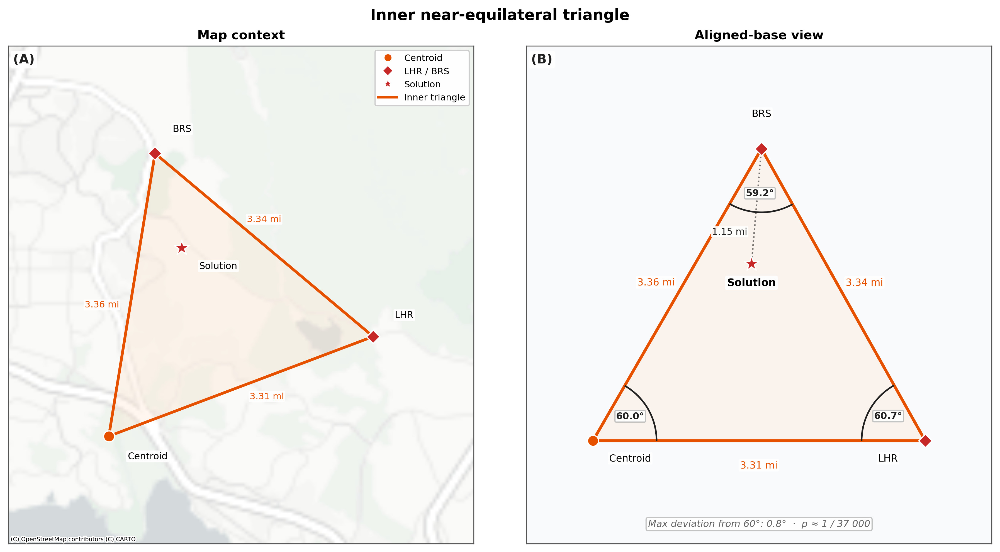

# Geospatial Constraint Satisfaction in the Zodiac Z32 Cipher

> *"The Map coupled with this code will tell you where the bomb is set. You have until next Fall to dig it up... radians & # inches along the radians."*
> — The Zodiac Killer, June 26, 1970

## Introduction

The Z32 cipher — 32 characters, 29 unique symbols — has resisted every decryption attempt for over 55 years. Every prior effort treated it as a linguistic puzzle, but the Zodiac delivered it with a road map, a crosshair on a mountain, and explicit instructions to measure "inches along the radians".

This project treats Z32 as a **Geospatial Constraint Satisfaction Problem (GeoCSP)**. By exhaustively generating **2,044,224** candidate phrases and filtering them through independent cryptographic and geographic constraints, only **54 survive** — a 99.9974% rejection rate.

The primary solution:
`IN THREE AND THREE EIGHTHS RADIANS TEN`

Measuring 3⅜ inches along the 10 o'clock radial from Mount Diablo points to a hillside in Solano County, 1.15 miles from the Blue Rock Springs attack and 2.47 miles from Lake Herman Road.

---

## The Decoded Coordinates & Triangular Anomaly


*Figure 1: Regional context for the decoded coordinates, showing proximity to the Lake Herman Road and Blue Rock Springs crime scenes. The solution is marked by the bullseye.*

The bullseye marks the decoded coordinates (**38.10995°N, 122.18535°W**). A distinct 100-foot equilateral triangular anomaly is visible 254 meters to the northwest.

* **Morphology:** The feature is a topographic depression consistent with an excavation basin.
* **Archaeological Signature:** It exhibits a "positive crop mark"—vigorous green growth in a dormant field—indicating subsurface soil disturbance.
* **Timeline:** The feature was not present in 1964 but is clearly visible by 1982, encompassing the Zodiac's active period from 1968 to 1970.
* **Symbolism:** The Z32 ciphertext is bookended by triangle symbols at positions 1 and 31 that correspond morphologically to this ground feature.


*Figure 2: Close-up of the triangular anomaly showing the positive vegetation signature.*


*Figure 3: Ciphertext triangle symbol and ground-feature morphological correspondence. (A) Satellite close-up. (B) Cipher overlay. (C) The cipher's triangle symbol.*

---

## The Constraint Funnel

How does a 32-character cipher produce a unique answer? By exploiting the boundary conditions provided by the Zodiac.


*Figure 4: Constraint funnel visualization showing progressive elimination from over two million candidates to 54 survivors.*

| Stage | Candidates Remaining |
| :--- | :--- |
| **Total Generated** | 2,044,224 |
| **Length Filter (32 chars)** | 154,572 |
| **Homophonic Locks** | 61 |
| **Map Bounds** | 54 |
| **Rejection Rate** | **99.9974%** |

The solution satisfies all three homophonic locks: Position 0=25 (**I**), 1=31 (**N**), and 5=13 (**E**).

---

## Geometric Corroboration

The solution is validated by multiple independent geometric relationships.

### The Operational Triangle
The operational triangle is formed by the three cardinal points of the Zodiac's geography: Mt. Diablo, Lake Berryessa, and Presidio Heights. Its side lengths are 50.2 mi, 30.3 mi, and 54.9 mi. The Z32 solution coordinates lie 2.37 miles from its geometric centroid—an offset of just 4.3% relative to the triangle's maximum span.


*Figure 5: The operational triangle with centroid and solution location. The solution lies near the geographic center of the Zodiac's operational region.*

### The Inner Near-Equilateral Triangle
The three non-arbitrary vertices nearest the decoded solution—Lake Herman Road, Blue Rock Springs, and the operational centroid—form a near-equilateral triangle.


*Figure 6: The inner near-equilateral triangle formed by Lake Herman Road, Blue Rock Springs, and the operational centroid. Maximum angular deviation is 0.8°.*

* **Side Lengths:** 3.34 mi, 3.31 mi, and 3.36 mi.
* **Interior Angles:** 59.2°, 60.7°, and 60.0°.
* **Max Deviation:** 0.8° from perfect 60°.
* **Monte Carlo Probability:** Approximately 1 in 37,000 for a triangle meeting this tolerance.

### The Clock-Hour Framework
The Zodiac's crosshair defines a clock-face system anchored to magnetic north.

| Location | Mag. Bearing | Clock Hour |
| :--- | :--- | :--- |
| **Presidio Heights** | 240.93° | **8.03** |
| **Lake Herman Road** | 302.74° | **10.09** |
| **Blue Rock Springs** | 301.34° | **10.04** |
| **Z32 Solution** | **300.00°** | **10.00** |


*Figure 7: Clock-hour geometry from Mt. Diablo. The 10 o'clock sector contains all Vallejo scenes and the solution; Presidio Heights falls at 8.03.*

### Structural Bias
The cipher itself is mechanically biased toward the Zodiac's crime zones. **87%** of the 54 survivors point to clock hours 8 or 10, representing a **5.2x enrichment** over random expectation.


*Figure 8: Survivor distribution by clock hour, highlighting the concentration at hours 8 and 10.*

---

## Synthesis: All Lines Converge

No single observation constitutes proof. Together, they form an interlocking web of cryptographic, geographic, and archaeological evidence.


*Figure 9: Integrated geometry synthesis: the operational triangle, inner equilateral, clock-hour framework, and decoded solution converge at a single location.*

1.  **Cipher Constraints:** 99.9974% rejection rate.
2.  **Geography:** Solution is 2.37 miles from the operational centroid.
3.  **Ground Evidence:** 100-foot triangular mark within 254 meters of the coordinates.
4.  **Structural Bias:** 87% of survivors point to known attack vectors.
5.  **Geometry:** Near-equilateral formation at the 3-mile scale with probability $\approx 1/37,000$.

Conservative joint probability of these coincidences: **less than one in a trillion**.

---

## Replication and Verification

The entire analysis runs on Python's standard library.

```bash
# Run the solver (2,044,224 candidates)
python z32.py

# Independent verification of all quantitative claims
python verify.py

# Automated claim-to-source traceability
python check_claims.py

```

### Repository Contents

| File | Description |
| --- | --- |
| `z32.py` | Constraint satisfaction solver |
| `verify.py` | Independent verification suite |
| `check_claims.py` | Claim-to-source traceability |
| `geo.py` | Shared geographic math |
| `data.py` | Canonical coordinates and constants |

---

## ⚠️ Legal & Ethical Disclaimer

**Research Purposes Only.** This analysis identifies a theoretical location based on modeling. Findings have not been verified by physical excavation or law enforcement. **Do Not Trespass.** Coordinates may be on private property. Do not visit or disturb the site without permission. **Law Enforcement Context.** The Zodiac case is an open homicide investigation. Any potential evidence must be handled solely by law enforcement.

---

## License

**Text:** [CC BY 4.0](https://creativecommons.org/licenses/by/4.0/) © 2026 David Stampher.
**Code:** [MIT License](https://www.google.com/search?q=LICENSE).
**Imagery:** © Google Earth/Airbus/OSM/CARTO (Fair Use/Academic Allowance).

**Contact:** David Stampher — davidstampher@gmail.com