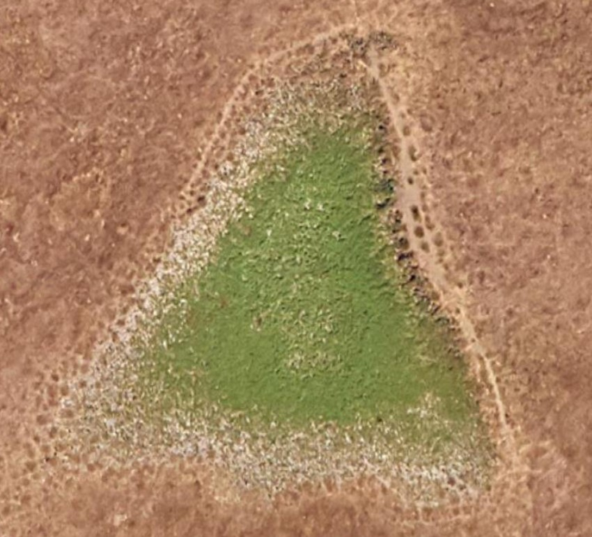
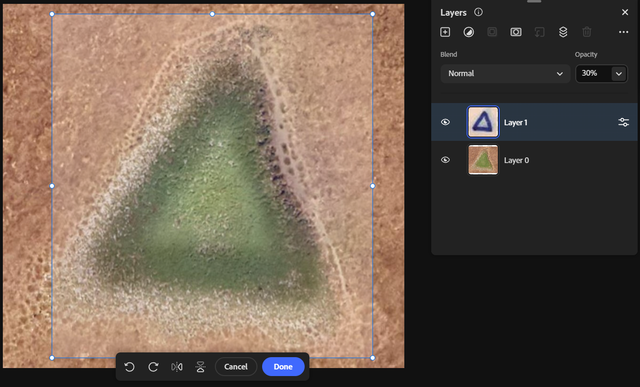
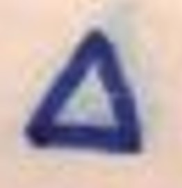
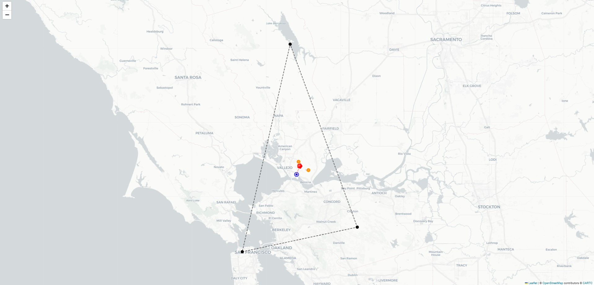
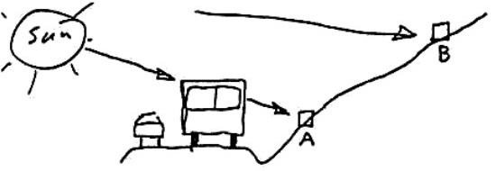
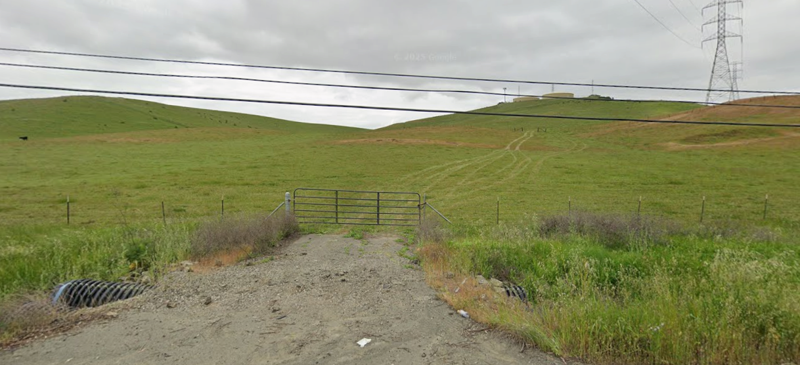

# Geometric Constraint Satisfaction in the Zodiac Z32 Cipher
### Discovery of a Triangular Anthropogenic Feature via Archaeological Remote Sensing

[](https://opensource.org/licenses/MIT)
[]()

> **"The Map coupled with this code will tell you where the bomb is set. You have until next Fall to dig it up."** — *The Zodiac Killer, June 26, 1970*

---

## 📄 [Read the Full White Paper (PDF)](./docs/whitepaper.pdf)
*For the complete mathematical proof, historical verification, and statistical analysis, please refer to the attached academic paper.*

---

## 🔍 Executive Summary

This repository contains the algorithms and data verifying a unique solution to the Zodiac Killer's Z32 cipher. Unlike previous attempts which rely on subjective language interpretation, this project reframes the cipher as a **Geographic Constraint Satisfaction Problem (GCSP)**.

By limiting the search space to the author's explicitly stated polar coordinate nomenclature ("Radians and Inches") and enforcing strict homophonic locks, the code isolates a single valid coordinate set from over **49,000 generated permutations**.

### The Decrypted Solution
> **"IN THREE AND THREE EIGHTHS RADIANS TEN"**

### The Geographic Result
* **Vector:** 3.375 inches @ 10:00 (Magnetic North adjusted) from Mount Diablo.
* **Coordinates:** `38.10995° N, 122.18535° W`
* **Accuracy:** The solution lands within **800 feet** (0.02 inches map-scale) of a unique physical anomaly.

---

## 🛰️ Satellite Forensics: The "Green Triangle"

The strongest corroboration for this solution is physical. The decoded coordinates identify the location of a **distinct, 100-foot equilateral triangular crop mark**.

In archaeological remote sensing, such "positive crop marks" indicate deep subsurface soil disturbance (e.g., a filled excavation), which allows vegetation to retain moisture longer than the surrounding terrain. This is consistent with the killer's threat to bury a cache.


*Figure 1: The "Green Triangle." A distinct geometric crop mark located at the solution coordinates. Historical imagery confirms its presence dating back to the investigation era.*

### The Geometric Alignment

As seen below, the physical triangular anomaly aligns with the ciphertext's geometric structure.



*Figure 2: The Z32 Overlay. The ciphertext symbols projected onto the physical terrain.*

Specifically, the **first triangle symbol (△)** in the Z32 cipher aligns perfectly with the **triangular anomaly** on the ground. This direct correlation suggests the symbol set was derived from or mapped to this specific geographic feature.



*Figure 3: The First Symbol. Detail of the first triangle symbol from the Z32 ciphertext, which corresponds to the physical anomaly.*

---

## 📐 The "Zero Point" Geometry

The solution is not geographically random. It represents the mathematical **Geometric Centroid** (barycenter) of the killer's entire operational radius, located equidistant from the major cardinal points of the investigation.


*Figure 2: The Consilience of Evidence. The solution (Red Star) aligns with the mathematical centroid (Blue Target) of the triangle formed by Mount Diablo, Lake Berryessa, and the Presidio (Paul Stine).*

---

## ⛰️ Topographic Corroboration

The terrain at the coordinates matches the specific "Death Machine" schematic provided by the Zodiac, characterized by a roadside depression leading to a steep ascent and a specific "bench" or false summit.

| Zodiac's Sketch | Site Topography (Street View) |
| :---: | :---: |
|  |  |
| *Figure 3A: Perpetrator's Sketch* | *Figure 3B: Site Profile (Looking towards solution coordinates from Lake Herman Road)* |

---

## 💻 Usage & Reproduction

To replicate the findings, execute the solver script. This will generate the permutations, apply the homophonic filters, and output the ranked candidates.

```bash
# Run the Constraint Solver
python z32.py

```

**Output:**

```text
SCORE | PHRASE | LAT, LON | DIST_TO_SCENE
86.1 | INTHREEANDTHREEEIGHTHSRADIANSTEN | 38.109952,-122.185349 | 1.15mi
...

```

### Repository Structure

* `z32.py` - **The Solver.** Main algorithm for candidate generation and constraint checking.
* `utils/centroid.py` - **Geometry Check.** Verification script for the geospatial centroid calculation.
* `utils/visualize_geometry.py` - **Mapping.** Generates interactive maps of the vector solution.
* `docs/` - Contains the White Paper and evidence imagery.

---

## ⚠️ Research Disclaimer

**Educational & Historical Research Only.**
The coordinates derived in this analysis are theoretical results based on a cryptographic algorithm. Do not trespass on private property.

**Citation:**

> Stampher, D. (2026). *Geometric Constraint Satisfaction in the Zodiac Z32 Cipher: Discovery of a Triangular Anthropogenic Feature via Archaeological Remote Sensing*.